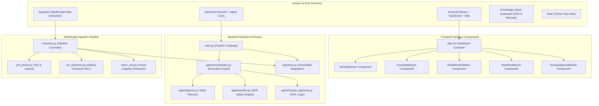
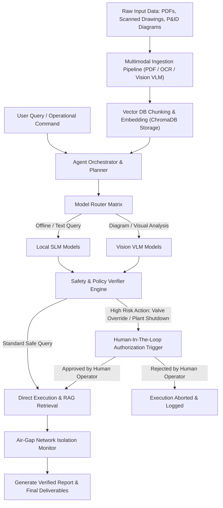

# Kavach AI

An autonomous, air-gapped multimodal AI agent system engineered for industrial safety, plant operations, document ingestion, vector retrieval, and human-in-the-loop operational verification.

---

## Executive Summary

### Problem Statement
Critical infrastructure, industrial plants, energy facilities, and government defense organizations operate under strict security boundaries where standard public cloud LLMs cannot be used due to severe data leakage risks, lack of domain-specific industrial safety compliance, absence of air-gap network enforcement, and lack of deterministic operational verification before executing high-risk commands.

### Solution
Kavach AI provides a zero-leakage, air-gapped intelligence platform. It combines multimodal document ingestion (P&ID diagrams, industrial SOPs, technical manuals), vector-indexed retrieval-augmented generation (RAG), multi-model routing (Local SLMs and Vision VLMs), automated policy verification, air-gap network isolation monitoring, and strict Human-In-The-Loop (HITL) approval workflows for critical operational actions.

---

## Project Structure



### Directory Taxonomy

```
kavach-ai/
├── backend/
│   ├── main.py                   # FastAPI server entry point & middleware configuration
│   ├── agent/
│   │   ├── orchestrator.py       # Core agent orchestrator & state execution graph
│   │   ├── planner.py            # Execution plan generator for user requests
│   │   ├── verifier.py           # Safety verification engine against SOP policies
│   │   ├── human_approval.py     # Human-in-the-loop authorization trigger & tracking
│   │   ├── tools_registry.py     # Tool definitions for RAG search, inspection, & execution
│   │   └── state.py              # Agent state definitions and schema
│   ├── api/
│   │   ├── agent_router.py       # Endpoints for agent interaction, planning, & execution
│   │   ├── rag_router.py         # Endpoints for document search, indexing, & vault management
│   │   └── system_router.py      # Endpoints for air-gap status, network monitoring, & models
│   ├── rag/
│   │   └── store.py              # ChromaDB vector store integration & embedding manager
│   └── storage/                  # Persistent vector stores, logs, and document uploads
├── frontend/
│   ├── src/
│   │   ├── App.tsx               # Main dashboard container & layout state
│   │   ├── components/
│   │   │   ├── AirGapMonitor.tsx        # Air-gap network isolation & bandwidth widget
│   │   │   ├── DeliverablesPreview.tsx  # Generated reports, plans, & artifact view
│   │   │   ├── HumanApprovalModal.tsx   # Modal for approving/rejecting critical actions
│   │   │   ├── KnowledgeVault.tsx       # Document management & vector search interface
│   │   │   ├── ModelMatrix.tsx          # Local model selection & telemetry status
│   │   │   ├── ModelRouterMatrix.tsx    # Intelligent query router allocation matrix
│   │   │   ├── MultimodalInspector.tsx  # Vision VLM & diagram inspector component
│   │   │   ├── Navbar.tsx               # Dashboard header & navigation bar
│   │   │   ├── NetworkMonitor.tsx       # Real-time request telemetry & connection status
│   │   │   ├── ScanWorkbench.tsx        # Multimodal scanning & input processing pane
│   │   │   └── VerificationBadge.tsx    # Policy & compliance status indicator
│   │   ├── services/
│   │   │   └── api.ts            # Frontend API client communicating with backend
│   │   └── types/
│   │       └── agent.ts          # TypeScript interfaces for agent state, logs, & tools
│   ├── package.json              # Frontend dependencies and scripts
│   └── vite.config.ts            # Vite bundler configuration
├── ingestion/
│   ├── extractor.py              # Unified document ingestion pipeline controller
│   ├── pdf_parser.py             # PDF text and layout extraction engine
│   ├── ocr_tesseract.py          # Optical Character Recognition for scanned images
│   ├── vision_vlm.py             # Multimodal Vision Language Model processing for P&ID diagrams
│   └── schemas.py                # Ingestion data structures and schemas
├── knowledge_base/               # Default domain manuals, SOPs, and technical guidelines
│   ├── Maintenance_Manual_Turbine_2025.txt
│   └── SOP_Industrial_Safety_v3.txt
├── tests/                        # Automated unit and integration test suite
│   ├── test_agent.py             # Tests for planner, verifier, and orchestrator
│   ├── test_ingestion.py         # Tests for PDF, OCR, and VLM document extraction
│   └── test_rag.py               # Tests for vector storage, chunking, and retrieval
├── requirements.txt              # Python dependencies for backend service
├── repomix-output.xml            # Packed XML export of entire codebase
└── start_demo.ps1                # Automated bootstrap script for backend & frontend
```

---

## Project Workflow



### Step-by-Step Execution Sequence

1. **Ingestion & Digitization**: Raw documents, scanned engineering drawings, P&ID diagrams, and operational manuals are ingested via OCR, PDF parsing, or Vision VLM extraction.
2. **Knowledge Base Storage**: Extracted content is chunked, embedded, and stored in an isolated ChromaDB vector database.
3. **Intent Planning & Routing**: The Agent Orchestrator breaks down user requests into discrete execution steps and routes sub-tasks to specialized local models via the Model Router Matrix.
4. **Safety Verification**: Proposed tool calls and operational steps are evaluated by the Verifier Engine against domain safety SOPs.
5. **Human Authorization**: If an operational action carries physical risk (e.g., turbine shutdown, valve override), execution pauses until explicit approval is provided via the Human-In-The-Loop interface.
6. **Air-Gapped Delivery**: Final outputs are generated within an isolated environment monitored by network isolation checks to guarantee data safety.

---

## Tech Stack

### Backend & Core Intelligence
- **Language**: Python 3.11+
- **API Framework**: FastAPI, Uvicorn
- **Agent Architecture**: Custom LangGraph / Orchestrator-Planner-Verifier Pattern
- **Vector Database**: ChromaDB
- **Document Ingestion**: PyPDF, Tesseract OCR, Vision VLM integrations
- **Testing**: Pytest

### Frontend & User Interface
- **Framework**: React 18 with TypeScript
- **Build Tool**: Vite
- **Styling**: Modern CSS / Tailwind CSS
- **Iconography**: Lucide React
- **State & API**: Fetch API / Custom React hooks

---

## Getting Started & Running Locally

### Prerequisites
- Python 3.11 or higher
- Node.js 18+ and npm
- Tesseract OCR (optional, for image OCR support)

### Installation & Startup

1. **Clone the repository**:
   ```bash
   git clone https://github.com/Mridu20/kavach-ai.git
   cd kavach-ai
   ```

2. **Backend Setup**:
   ```bash
   # Create and activate virtual environment
   python -m venv .venv
   .venv\Scripts\activate   # Windows
   # source .venv/bin/activate # Linux/macOS

   # Install dependencies
   pip install -r requirements.txt

   # Start backend server
   uvicorn backend.main:app --reload --port 8000
   ```

3. **Frontend Setup**:
   ```bash
   cd frontend
   npm install
   npm run dev
   ```

4. **Automated One-Click Startup (Windows)**:
   ```powershell
   .\start_demo.ps1
   ```

---

## Enterprise and Government Scaling Roadmap

While the current codebase demonstrates the complete workflow in a prototype environment, scaling Kavach AI for enterprise and defense installations requires upgrading key infrastructure layers:

### 1. Hardware-Enforced Air-Gap Architecture
- **On-Premise GPU Inference**: Transition from cloud API endpoints to locally hosted, quantized open-weights models (e.g., LLaMA-3 70B, Qwen-2.5-VL, DeepSeek-R1) running on air-gapped NVIDIA DGX / HGX clusters.
- **Network Isolation Verification**: Implement kernel-level eBPF network monitoring to enforce zero-outbound traffic policies automatically.

### 2. Zero-Trust Access & Identity Management
- **Smart Card & PKI Integration**: Incorporate CAC/PIV smart-card authentication, hardware security modules (HSMs), and fine-grained Role-Based Access Control (RBAC).
- **Multi-Level Security (MLS)**: Classify knowledge vault documents by security clearance levels (Unclassified, Confidential, Secret) with dynamic query redaction.

### 3. Enterprise Data & Knowledge Graph RAG
- **Distributed Vector Search**: Upgrade local ChromaDB instance to enterprise-grade distributed vector clusters (Milvus / Qdrant) with high availability.
- **Knowledge Graph RAG**: Integrate graph databases (Neo4j / Memgraph) alongside vector stores to map complex industrial asset topologies, dependency trees, and operational cascade risks.

### 4. Auditing & Compliance Standard Enforcement
- **Cryptographic Audit Logs**: Store all agent decisions, tool invocations, and operator approvals in tamper-evident, append-only cryptographic ledgers.
- **Regulatory Alignment**: Ensure strict compliance with NIST SP 800-53 (FedRAMP High), ISO 27001, and IEC 62443 industrial cybersecurity standards.

### 5. Multi-Agent Swarm Orchestration
- **Specialized Sub-Agents**: Expand the single orchestrator into a multi-agent swarm architecture comprising dedicated agents for Cyber Threat Analysis, Plant Safety Inspection, Preventive Maintenance, and Supply Chain Risk Assessment.

---

Build by Team Farebi